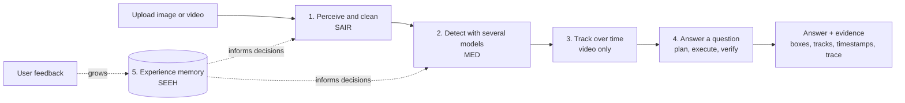
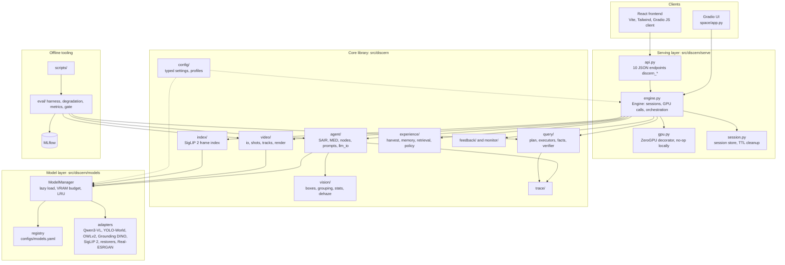
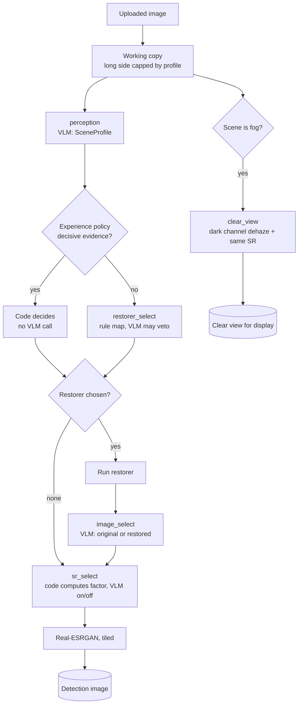
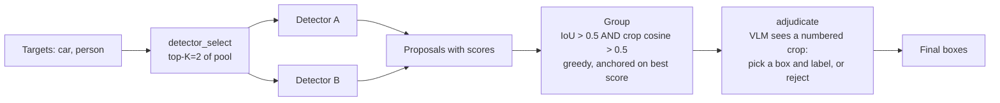
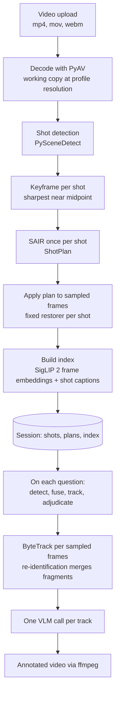
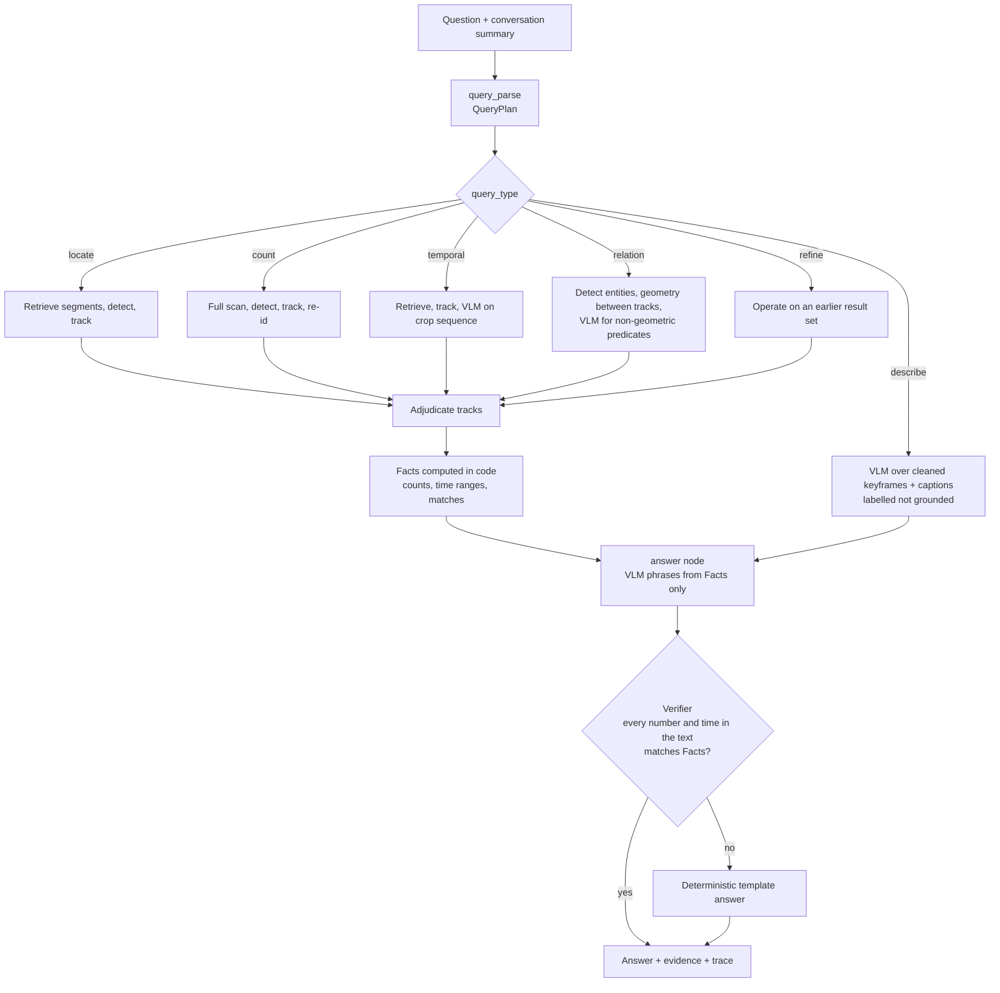
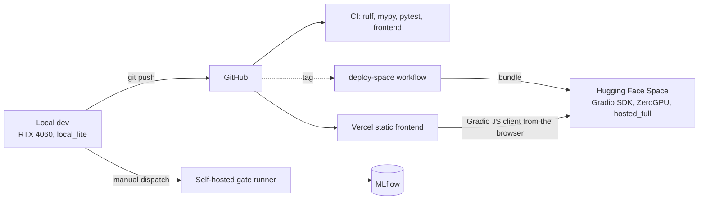

# Discern

**Ask a video a question and see the evidence.**

Discern is a degradation-aware, grounded video query agent. You upload a video or an image. Discern
looks at the footage, decides whether and how to clean it (fog, rain, night, noise), finds and tracks
what is in it with several open detectors, and answers questions in natural language, including
follow-ups. Every answer that involves finding, counting, timing or relating objects points at boxes,
tracks and timestamps you can inspect, and every number in the answer is computed by code and
checked before it is shown.

It is built on the ideas of *Detect in Any Scene: An Agentic Framework for Object Detection with
Experience-Aware Reasoning* (DetAS / DetAS-X, arXiv 2605.31174), extended from still images to video
and question answering. It uses open models only, costs nothing to run, works on an 8 GB laptop GPU,
and is packaged for a Hugging Face ZeroGPU Space.

> **Status: working research prototype.** Everything quantitative in this document was measured by
> runs in this repository. Nothing here is a claim about a hosted deployment: the Hugging Face Space
> has not been published. Section 12 lists what did not work, and section 13 what is not done.

**Contents**

1. [The problem](#1-the-problem)
2. [The solution in one page](#2-the-solution-in-one-page)
3. [The paper and what we took from it](#3-the-paper-and-what-we-took-from-it)
4. [Design principles](#4-design-principles-the-rules-the-code-is-held-to)
5. [System architecture](#5-system-architecture)
6. [How an image is cleaned (SAIR)](#6-how-an-image-is-cleaned-sair)
7. [How objects are found (MED)](#7-how-objects-are-found-med)
8. [Video: shots, tracks, index](#8-video-shots-tracks-index)
9. [Questions and follow-ups](#9-questions-and-follow-ups)
10. [Experience memory (SEEH)](#10-experience-memory-seeh)
11. [Backend, API and frontend](#11-backend-api-and-frontend)
12. [Measured results, including failures](#12-measured-results-including-failures)
13. [What is not done](#13-what-is-not-done)
14. [MLOps: tests, CI, gate, tracking](#14-mlops-tests-ci-gate-tracking)
15. [Deployment](#15-deployment)
16. [Running it](#16-running-it)
17. [Repository map](#17-repository-map)
18. [Data model reference](#18-data-model-reference)
19. [Licenses, privacy, limits](#19-licenses-privacy-limits)
20. [Guide for agents and contributors](#20-guide-for-agents-and-contributors)

---

## 1. The problem

Modern video language models answer questions about video fluently. On real footage that is a trap
for three reasons.

1. **Degraded footage breaks them.** Fog, rain, night, low light and sensor noise are the normal
   condition of dashcams, drones, field cameras and CCTV. The DetAS paper shows that multimodal
   detectors collapse under these conditions. A fluent answer built on a missed object is worse than
   no answer.
2. **The answers cannot be audited.** "I can see about five cars" gives you nothing to check. There
   is no box, no timestamp and no way to know whether the number came from the picture or from the
   model's habit of sounding plausible.
3. **They are weak at exactly what analysts ask.** Counting, locating, timing ("when did the van
   leave?") and relating ("which people are near the truck?") are quantitative questions. Language
   models are unreliable at quantities.

A person who has to be right about what a clip shows (traffic and site review, wildlife and field
cameras, drone and dashcam footage, research on detection under degradation) needs an answer that
carries its own evidence and admits where it is unsure.

### What this project is not trying to be

- Not a general chat-about-video product. Purely descriptive questions are answered by the VLM over
  cleaned frames and are **labelled "not grounded"**. The system does not pretend its detection
  machinery helps there.
- Not real-time or live-camera. Not a long-video product on the hosted tier (short clips only).
- Not a training project. Detectors are used off the shelf; nothing is trained from scratch.

## 2. The solution in one page

Discern separates **judgement** from **computation**.

- **Code computes.** Counts, timestamps, boxes, IoUs, tracks and every metric come from
  deterministic code.
- **The VLM judges.** A vision-language model (Qwen3-VL) is asked only to choose, classify,
  adjudicate and phrase: which restorer, original or restored, which detectors, accept or reject this
  group of boxes, how to word the answer. It never invents a quantity.

The pipeline has five stages.



1. **Perceive and clean (SAIR).** A VLM labels the scene (normal, fog, rain, underwater, low light,
   noise) and rates illumination, visibility, object scale and density. Code maps the label to a
   restorer. The VLM may veto it and compares original and restored frames on detection-relevant
   criteria. Super-resolution is sized by code and approved by the VLM.
2. **Detect with several models (MED).** Open-vocabulary detectors propose boxes. Proposals for the
   same object are grouped by overlap and crop similarity. A VLM looks at a crop of each group and
   picks the best box and label, or rejects the group.
3. **Track (video).** Detections are linked across frames into tracks with ByteTrack, merged by
   appearance when an identity breaks, and adjudicated once per track.
4. **Answer.** A parsed query plan is executed in code to produce facts. The VLM phrases the answer
   from the facts. A verifier checks every number and time in the text against the facts and falls
   back to a template if they disagree.
5. **Remember (SEEH).** Harvested measurements of which choice worked best under which conditions
   are retrieved and shown to the decision nodes. User feedback is stored and can grow the memory.

### The two outputs for a hazy image

Cleaning produces two pictures, deliberately:

- the **detection image**: whatever SAIR judged best for finding objects. On hazy aerial frames this
  is usually the original, because our measurements show restoration often lowers detection F1;
- the **clear view**: a haze-free picture for you to look at, made by a classical dark-channel
  dehaze. It is display only, and the UI says which image detection used.

## 3. The paper and what we took from it

DetAS is an agentic detector for degraded scenes. Its three mechanisms, and how Discern implements
them:

| Paper mechanism | Paper specifics | Discern implementation |
|-|-|-|
| **SAIR** self-adaptive image restoration | MLLM predicts scene label; one restorer per label (RIDCP, MPRNet, SwinIR, LLFlow); MLLM chooses original vs restored by visibility, boundaries, structure; ESRGAN to a 2K target | `perception`, `restorer_select`, `image_select`, `sr_select` nodes in `src/discern/agent/` |
| **MED** multi-expertise detection | Top-K=2 experts chosen; proposals grouped by IoU > 0.5 and crop cosine > 0.5 (crop = 32x32, box expanded by alpha=0.25); MLLM picks per group or rejects | `detector_select` node, `vision/grouping.py` (the paper's equations), `adjudicate` node |
| **SEEH** self-evolving experience harvesting | 50 labelled images per dataset, per-node F1 recorded by scene profile, top-3 similar profiles injected at inference | `src/discern/experience/` |

What Discern adds: shot-level planning for video, tracks as temporal instance groups, per-track
adjudication, a video index for retrieval, a query planner with five query types, conversational
follow-ups over result sets, an answer verifier, and a user feedback loop into the memory.

Paper values live in `configs/thresholds.yaml` and are used as defaults: alpha 0.25, IoU 0.5,
visual similarity 0.5, top-K detectors 2, SR target 2048 px, experience top-K 3, harvest 50 samples
per dataset. Every place where we interpreted or deviated is in the table in section 3.1.

### 3.1 Interpretations and deviations

| Topic | Paper | Discern | Reason |
|-|-|-|-|
| Detector pool | Qwen3-VL-8B fine-tuned per benchmark, plus Rex-Omni | Off-the-shelf open-vocabulary detectors (YOLO-World v2, OWLv2, Grounding DINO) and the VLM's own grounding | Users name arbitrary targets; no training on test domains; $0 |
| Grouping assignment | Joins "an existing group" if both conditions hold; compared against what is unspecified | Greedy by score, compared against the group's anchor (highest-score member) | Avoids chain merging in dense scenes |
| Profile similarity | Top-K most similar profiles; similarity unspecified | Zero across scene labels; weighted ordinal match on attributes within a label | Interpretable and testable |
| Node-level experience value | Records "metrics such as F1" per node | Best F1 achievable given the option (max over other nodes), plus raw per-configuration records | A well-posed per-node quantity |
| Harvest cost | Exploratory runs under many configurations | Cached detector outputs, cheap fusion scoring, full adjudication only on a few top configurations | Makes harvesting feasible on a laptop |
| Experience key | Scene profile | Scene profile plus query type | The best tool differs between counting dense objects and locating one |
| Video | Not addressed | One SAIR plan per shot, per-frame fusion, tracks as groups, per-track adjudication | Per-frame agent calls are infeasible |
| Super-resolution in video | Applied with an automatic factor | Off by default in video | The most expensive step per frame |
| Local VLM | Qwen3-VL-8B | Qwen3-VL-4B in 4-bit | 8 GB VRAM: 4B in bf16 needs about 8.9 GB of weights alone |
| Display view | Not addressed | A separate haze-free "clear view" for foggy scenes; detection input unchanged | Detection-optimal and human-optimal images differ |
| Python | Not addressed | 3.12 | ZeroGPU supports only 3.12.12 and 3.10.13 |

## 4. Design principles (the rules the code is held to)

These are enforced by tests, types or review. Break one and something should fail loudly.

1. **Code computes, the VLM judges.** The answer composer verifies that every number in the final
   text matches computed facts, and falls back to a template if not.
2. **Every VLM call is structured.** Prompts are versioned files in `src/discern/agent/prompts/`
   (`name.vN.txt`). Output is JSON validated by a Pydantic model. On failure: one repair retry, then a
   deterministic fallback rule. Free text is never parsed as a primary path.
3. **No hardcoded model IDs.** Models are referenced by role through a registry
   (`configs/models.yaml`) and the active profile (`configs/profiles/*.yaml`).
4. **VRAM discipline.** All model loading goes through `ModelManager`, which enforces a VRAM budget
   and evicts least-recently-used models. Nothing calls `.to("cuda")` outside it.
5. **Paper fidelity is explicit.** Paper values are config defaults; deviations are tabled.
6. **Everything is traced.** Every node emits a `TraceEvent`: node, input summary, decision,
   rationale, duration, GPU milliseconds, model and prompt versions, whether a fallback fired.
7. **No fabricated data.** Numbers shown to users come from real runs, or the UI says "not measured
   yet". Examples are labelled as examples.
8. **Determinism for decisions.** Decision nodes use temperature 0 and fixed seeds. Evaluation runs
   record config hash, model versions, prompt versions and experience-memory version.
9. **Boxes have one convention.** Absolute pixel `xyxy` floats in the coordinate space of the original
   upload. Every adapter converts at its boundary (super-resolution scale, working-copy scale, the
   VLM's own coordinate convention), in one place each.
10. **One codebase, two profiles.** `hosted_full` and `local_lite` differ only in configuration.
11. **Privacy by default.** Uploads live in a session directory and are deleted on a time limit.
    Media is kept for feedback only with explicit opt-in.

## 5. System architecture

### 5.1 Layers



1. **Core library (`discern`).** All agent logic, vision math, video processing, query handling,
   experience memory and tracing. No dependency on the serving layer.
2. **Model layer.** A registry of models, profiles that choose which are active, `ModelManager`, and
   adapters that wrap each model behind a **role interface** (VLM, detector, restorer, super-resolver,
   embedder). Swapping a model is a config change.
3. **Serving layer.** `Engine` owns sessions and GPU-decorated calls; `api.py` exposes them as JSON;
   `gradio_app.py` mounts both a Gradio UI and the JSON endpoints.
4. **Offline tooling.** Dataset loaders, synthetic degradation, evaluation runners, harvest, the CI
   gate, Space bundle builder.

### 5.2 The model layer in detail

**Registry** (`configs/models.yaml`). One entry per model: role, model ID, pinned revision, license,
speed class (`fast` or `slow`), adapter class, approximate VRAM. **Profiles** pick one entry per role.

| Role | `local_lite` (8 GB) | `hosted_full` (ZeroGPU) |
|-|-|-|
| Agent VLM | Qwen3-VL-4B-Instruct, 4-bit | Qwen3-VL-8B-Instruct, bf16 |
| Detector, fast | YOLO-World v2 | YOLO-World v2 |
| Detector, accurate | OWLv2 base | Grounding DINO base |
| Embedder | SigLIP 2 base | SigLIP 2 base |
| Dehaze restorer | classical dark-channel prior | classical dark-channel prior |
| Derain / denoise / low-light | MPRNet / SwinIR / Zero-DCE++ | MPRNet / SwinIR / Zero-DCE++ |
| Super-resolution | Real-ESRGAN x4plus, tiled | Real-ESRGAN x4plus, tiled |
| Shot detection / tracker | PySceneDetect / ByteTrack (supervision), both CPU | same |

Also in the registry but not in the default profiles: RIDCP and LLFlow (dehaze and low-light,
non-commercial or research-only), Rex-Omni (research-only detector).

**`ModelManager`.** The single owner of loaded models. `get(role)` loads lazily, accounts VRAM per
model, enforces the profile's budget (7 GB local, 40 GB hosted), evicts least-recently-used models,
and exposes `free`. A lock serializes loading. On the local 4060, loading the VLM next to a detector
nears the 8 GB limit and makes everything about 10x slower, so the engine evicts the VLM before heavy
detector work.

**Adapters** (`models/adapters/`) hide library details. Qwen3-VL's box coordinates, which are
normalised to 0-1000, are converted in one adapter. Real-ESRGAN runs tiled so large images fit.

### 5.3 The agent layer

Each decision node has a prompt file, a Pydantic output schema, a deterministic fallback and a trace
event. `agent/llm_io.py` implements the shared call: render prompt, call the VLM at temperature 0,
validate, repair once, else fall back.

| Node | Input | Output | Deterministic fallback |
|-|-|-|-|
| `perception` | keyframe | `SceneProfile` (scene label, illumination, visibility, object scale, object density, confidence) | profile from image statistics (`vision/stats.py`: luminance, dark-channel strength, contrast, noise) |
| `restorer_select` | profile, experience | restorer name or `none`; may only veto the mapped restorer, never invent one | the rule map: fog to dehaze, rain to derain, noise to denoise, low light to low-light, else none |
| `image_select` | original (A) and restored (B) | `original` or `restored` by object visibility, boundary clarity, structural integrity (not aesthetics) | `original` (restoration is opt-in when unsure) |
| `sr_select` | resolution, profile, experience | `off` or the factor code computed to reach 2048 px | the computed factor |
| `detector_select` | targets, profile, detector catalog, experience | top-K detector names | a fixed priority order of the available detectors |
| `adjudicate` / `adjudicate_track` | crop with numbered candidate boxes | chosen candidate and label, or reject | accept the anchor box if its score is at least 0.3 |
| `query_parse` | question plus conversation summary | `QueryPlan` | a describe query carrying the raw question (so the answer is labelled ungrounded) |
| `answer` | computed `Facts` | answer text | a deterministic template |
| `caption`, `attribute_check` | shot keyframe / track crop | shot caption; attribute value | empty caption (skipped, never invented) / `unknown` (never matches a requested value) |

Guards make the VLM's freedom narrow: a restorer outside the allowed set is replaced by the rule map
(`restorer_select.guard`), and an SR factor that differs from the computed one is replaced by the
computed one (`sr_select.guard`). Both emit a trace event with `fallback_used`.

## 6. How an image is cleaned (SAIR)



The same logic runs once per **shot** in video, on the shot's keyframe, and the resulting `ShotPlan`
(restorer, use_restored, sr_factor, decisions with rationales) is applied to every sampled frame of
the shot. One plan per shot avoids flicker and keeps agent calls affordable.

**Restorers.** Dehaze: classical dark-channel prior (no weights, always available; the registry also
lists RIDCP). Derain: MPRNet. Denoise: SwinIR, with a classical non-local-means fallback. Low light:
Zero-DCE++ for speed, with CLAHE plus gamma as a classical fallback. If a restorer fails or is
missing, the plan records it and proceeds with `none`.

**The clear view** (`vision/dehaze.py`). Dark channel prior with a guided-filter transmission map,
a neutral (grey) airlight estimate, reduced chroma gain so colours do not blow out, a shared
auto-levels stretch, and an exposure correction that keeps mean brightness near the input's. Pure
numpy and OpenCV, no weights. It exists because our measurements say the detection-optimal image is
often the unrestored original, which looks hazy to a person.

## 7. How objects are found (MED)



**Grouping** (`vision/grouping.py`, the paper's equations 1 and 2). Each box is expanded by alpha=0.25,
cropped, resized to 32x32, flattened and L2-normalised. In descending score order a box joins an
existing group if its IoU with the group's anchor exceeds 0.5 and the cosine similarity of the two
crops exceeds 0.5; otherwise it starts a new group.

**Adjudication** (`agent/nodes/adjudicate.py`). For each group, the crop around the union of its boxes
is widened to at least 96 px and upscaled so the VLM sees at least 224 px on the short side; candidate
boxes are drawn with numbers; the VLM picks one and a label from the target list, or rejects the group.
In video the same prompt runs once per track on up to three best crops.

**Detector thresholds.** Each detector has its own tuned operating threshold from a held-out harvest
split, because one global cutoff wrongly favoured YOLO-World during harvest.

## 8. Video: shots, tracks, index



1. **Decode and normalise.** Working copy at the profile's resolution (hosted default 1280 px long
   side, 720p); the original is kept for rendering. Duration and size limits are checked first.
2. **Shots and keyframes.** PySceneDetect content detector, minimum shot length 1 s, keyframe by
   Laplacian sharpness near the shot midpoint.
3. **Sampling.** Detection runs at a configurable stride (2 fps local, 5 fps hosted).
4. **Per-frame fusion.** Detector proposals for each sampled frame are grouped with the same
   equations, without VLM calls.
5. **Tracking.** ByteTrack over fused boxes. Thresholds are recall-oriented (0.15) because tracks are
   adjudicated later.
6. **Re-identification.** Tracks are merged when SigLIP 2 crop embeddings have cosine at least 0.8
   and the time gap is at most 2 s, to limit over-counting from identity switches.
7. **Track adjudication.** One VLM call per track. An accepted label propagates to all its frames;
   rejected tracks are dropped but kept in the trace.
8. **Index.** SigLIP 2 embeddings per sampled frame and a short VLM caption per shot, used to rank
   segments for a query.
9. **Rendering.** An annotated H.264 video plus per-track JSON.
10. **ZeroGPU chunking.** GPU work is split by shot, and progress is streamed per stage so each GPU
    call stays under the per-call limit.

## 9. Questions and follow-ups



**Query types and what code computes.**

| Type | Strategy | Facts computed in code |
|-|-|-|
| locate | retrieval, detection, tracking, adjudication | track list, first and last seen, boxes per frame |
| count | full scan, detection, tracking, re-identification, adjudication | number of distinct accepted tracks, per-track evidence |
| temporal | retrieval, tracking, VLM over a track's crops for the event | time range of the event |
| relation | detect each entity, geometry between tracks, crop-level VLM for non-geometric predicates | matching track pairs and time ranges |
| describe | VLM over cleaned keyframes and captions | none (answer is labelled ungrounded) |
| refine | operate on an existing result set | filtered tracks, recomputed counts |

Geometric predicates are code: `near` (centre distance at most 1.0x the mean box diagonal),
`left_of`, `above` and similar (centre offset at least 0.5x the mean box size), `overlapping`
(intersection over the smaller box at least 0.1), and region filters (centre in region for at least
half of a track's frames).

**Retrieval is a pruning aid, not ground truth.** Count queries always scan the full video at the
sampling stride. Locate and temporal queries fall back to a full scan if retrieved segments yield no
accepted track.

**The verifier** (`query/answer.py`) extracts numbers, quantity words and timestamps from the answer
text and compares them with `Facts` (times within 0.5 s). A mismatch replaces the text with a
template. Measured pass rate on the video evaluation: 0.962.

**Follow-ups.** The session holds a `ConversationState`: ordered turns and result sets by ID.
`query_parse` receives a compact summary (IDs, targets, counts, time ranges) and resolves references
such as "only the red ones" to the earlier result set plus an attribute filter. Refine operations
reuse existing tracks; attribute checks run a crop-level VLM classification, cached per
(track, attribute). A server restart loses sessions, which is acceptable at this scale.

## 10. Experience memory (SEEH)

The idea: the right restorer, super-resolution setting and detector pair depend on the scene, and
that can be learned from labelled data rather than guessed.

**Harvest** (`experience/harvest.py`, `scripts/harvest.py`):

1. Sample 50 labelled images per dataset and compute each image's scene profile.
2. Enumerate configurations: restorer in {none, mapped}, SR in {off, auto}, detector set in every
   single and pair of the pool. That is 34 configurations per image.
3. Cache detector outputs per (image variant, detector) so every configuration is a recombination of
   cached outputs.
4. Score each configuration with cheap fusion and F1 at IoU 0.5. Run full VLM adjudication only for
   the top configurations to confirm.
5. Aggregate per (profile key, query type, node, option): mean, standard deviation, count. Node-level
   value of an option is the best F1 achievable given that option.

Result: 4 datasets x 50 images x 34 configurations = 6800 records.

**Retrieval** (`experience/retrieval.py`): profile similarity is zero across scene labels, otherwise a
weighted ordinal match (illumination 1.0, visibility 1.0, object scale 0.5, density 0.5). The top 3
profiles are returned.

**Two ways to use it.**

- **Injection:** a compact line per node, such as "Similar scenes (3): dehaze F1 0.52 (n=14) vs none
  0.47 (n=14)", appended to that node's prompt.
- **Policy** (`experience/policy.py`): where evidence is decisive (at least 10 samples per compared
  option and a margin of at least 0.02 over the runner-up), code decides the node and no VLM call is
  made. Two modes: `node` (each node independently) and `joint` (best whole configuration for the
  scene, the default).

**Versioning and promotion.** Each memory build is a versioned file (`data/memory/memory-<version>.json`)
with a pointer file that pins the live version. A candidate version is promoted only if it passes the
evaluation gate (`experience/promotion.py`).

**Feedback loop.** Users can mark answers and individual boxes correct, wrong or missing, and opt in
to retaining media. Feedback is stored (`feedback/`). Turning feedback into new memory versions is
specified but only partly wired (section 13).

## 11. Backend, API and frontend

### 11.1 Engine and sessions

`serve/engine.py` is the application service. It builds the model registry and `ModelManager` from the
active profile, owns the session store (`serve/session.py`: directory per session, TTL cleanup every
5 minutes, default TTL 1 hour), and exposes methods such as `clean_image`, `detect_targets`, `ingest`,
`shot_previews`, `ask`, `annotated_video`, `submit_feedback`. GPU work sits in methods wrapped by
`@gpu(duration=...)` (`serve/gpu.py`), which applies `spaces.GPU` only on a ZeroGPU runtime and is a
no-op locally. Limits (upload size 50 MB, image 50 megapixels, video length per profile, 20 questions
per session) come from config.

### 11.2 JSON API (`serve/api.py`)

The Gradio app exposes ten endpoints with explicit names; the React client calls them with the Gradio
JavaScript client. Every endpoint returns `{ok: true, ...}` or `{ok: false, error: "<message>"}` and
never raises to the browser. Media are returned as URLs.

| Endpoint | Purpose |
|-|-|
| `/discern_info` | profile, limits, model list with licenses, measured GPU seconds, memory version |
| `/discern_upload` | store an image or video; returns session id and kind |
| `/discern_clean` | SAIR on an image; returns original, cleaned and **clear view** URLs, which image detection used, profile, plan and trace |
| `/discern_detect` | detection with optional target names; annotated image and detections |
| `/discern_ingest` | video ingest as a progress stream, then shots with plans and before/after previews |
| `/discern_ask` | question; answer, grounded flag, evidence tracks and trace |
| `/discern_annotated_video` | render the annotated video for a result set |
| `/discern_trace` | the session's trace events |
| `/discern_feedback` | correct / wrong / missing verdicts, optional media retention |
| `/discern_cleanup` | delete the session now |

The full contract is in `frontend/API.md`.

### 11.3 Frontend (`frontend/`)

React 19, TypeScript, Vite, Tailwind v4, Phosphor icons, Vitest. Hash routing, so it deploys as a
static site. Views: a landing page, **Clean** (upload, before and clear view, scene profile, plan
decisions, detection), **Ask** (chat with an evidence panel and annotated video), **Trace** (every
node with timings), **Feedback**, **About** (only API-reported values or "not measured yet").
While a call runs, a progress panel lists the stage's steps with a timer; for single calls the
highlighted step is an estimate, and for video it shows the server's real stage message and percent.
`?mock=1` runs the whole UI against an in-browser mock with clearly labelled demo data; `?space=<url>`
points the client at another backend (https `hf.space` or localhost only).

Design: an editorial "photo desk" look (parchment, bone, ink, one ember accent used only for
evidence marks and focus), IBM Plex Sans and Mono for text, Montserrat for display, all self-hosted.
See `docs/brand-guidelines.md`, `docs/typography.md` and `frontend/design-system/MASTER.md`.

## 12. Measured results, including failures

F1 at IoU 0.5 on fixed 100-image gate subsets (detector thresholds tuned on separate 50-image splits).
Datasets come from unofficial Hugging Face mirrors (BDD100K validation, HazyDet real-world, DarkFace,
COCO val2017); MARIS was not used. The detectors are off the shelf, so absolute numbers are not
comparable to the paper's, whose experts were fine-tuned; the point is the relative effect of each
mechanism.

| method | COCO | BDD clear | BDD rainy | BDD night | HazyDet | DarkFace |
|-|-|-|-|-|-|-|
| YOLO-World v2 | 0.660 | 0.520 | 0.533 | 0.436 | 0.387 | 0.000 |
| OWLv2 base | 0.492 | 0.613 | 0.643 | 0.516 | 0.664 | 0.137 |
| Grounding DINO base | 0.621 | 0.259 | 0.256 | 0.202 | 0.187 | 0.148 |
| Qwen3-VL-4B (zero-shot) | 0.547 | 0.534 | 0.586 | 0.501 | 0.411 | 0.155 |
| legacy v0 (classical restoration + YOLOv8n) | 0.614 | 0.494 | 0.543 | 0.360 | 0.208 | 0.000 |

The COCO subset keeps COCO's crowd boxes as ground truth (the loader now skips them; the numbers above
predate that fix). The legacy v0 row picks its restorer from the dataset's scene label.

**Findings on the degraded sets (OWLv2 as the detector):**

- **Restoration usually lowers F1.** Always-restore: HazyDet 0.593 vs 0.664 unrestored, night 0.438 vs
  0.516. The VLM image selector avoids that harm by rarely accepting a restored image, so SAIR
  behaves like "do not restore"; it matches always-restore on rainy (0.643 vs 0.648) and is below it on
  DarkFace (0.137 vs 0.189). This is why the display "clear view" is separate from the detection image.
- **Fusing the best two detectors is about equal to the best single detector** on the full gate
  (differences from -0.003 to +0.012). Fusing all three is clearly worse. Full MED with VLM
  adjudication, on the first 12 gate images per dataset, led the best single detector on all four
  datasets, but by noise-level margins on two.
- **Experience did not help.** End-to-end F1 on 40 gate images per dataset, DetAS without experience /
  experience by code per node / by best joint configuration: HazyDet 0.550 / 0.544 / 0.530, BDD night
  0.565 / 0.524 / 0.524, BDD rainy 0.652 / 0.663 / 0.663, DarkFace 0.214 / 0.203 / 0.203. Putting
  evidence in the prompt changed nothing: the 4B VLM ignored it (it chose super-resolution on 16 of 16
  test images whichever way the evidence pointed). Per-image harvest F1 with cheap fusion does not
  predict end-to-end behaviour well enough to beat the defaults.
- **The adjudicating VLM discriminates poorly.** In a diagnostic on BDD night it kept 42 of 50 false
  groups (and all 9 real ones). Most of MED's value here is cost-free fusion, not judgement.

**Video**, on 24 synthetic 8-second clips built from labelled BDD frames (slow zoom; some fogged
synthetically), with true object counts taken from the image labels: count exact-match **0.136**,
mean absolute error **2.8**, box F1 **0.567**, answer verifier pass rate **0.962**, about **22 GPU-seconds per
video-second** on an RTX 4060. Counts are mostly too low (37 of 51 label counts under the truth).
Hosted speed and quota were not measured. Only locate and count were run with real models; temporal,
relation, describe and follow-up chains are tested with fakes only.

## 13. What is not done

Stated plainly, so nothing here is mistaken for a result.

1. **No hosted deployment.** The Hugging Face Space has not been created. The bundle builder, the
   entrypoint and the deploy workflow exist and the bundle is tested, but ZeroGPU behaviour, quotas
   and per-call limits are unmeasured. The `gpu_seconds` values in `thresholds.yaml` are placeholders.
2. **SEEH does not beat plain DetAS** in our measurements (section 12).
3. **SAIR does not beat always-restore** on rainy and DarkFace, and counts in video run low.
4. **Feedback to memory is not wired.** The harvest step of `scripts/feedback_loop.py` is a stub; no
   real user feedback exists.
5. **Self-hosted GPU gate runner not registered.** The gate workflow is dispatch-only until it is.
6. **Real-footage evaluation** (hand-labelled degraded clips) was not built; the video numbers are on
   synthetic clips.
7. **Dehazed-detection** is an option, not the default: we did not re-run the hazy evaluation with the
   clear view as the detection input.
8. **Vercel project** for the static frontend currently fails its build in the Vercel dashboard
   (the same build passes in CI), likely a project-settings issue.

## 14. MLOps: tests, CI, gate, tracking

- **Tests.** About 600 CPU tests using fakes (`FakeVLM` returns fixture JSON per prompt name;
  `FakeDetector`, `FakeRestorer`, `FakeEmbedder`), so all logic (grouping, tracking glue, query
  execution, the verifier, experience retrieval, API, engine) runs without a GPU. Prompt rendering
  has golden snapshot tests, so prompt edits show up in diffs. Frontend: Vitest, typecheck, lint, build.
  GPU tests carry the `gpu` marker and run locally.
- **CI** (`.github/workflows/ci.yml`, GitHub-hosted, CPU): `ruff`, `mypy` (strict on core), `pytest`
  with the `core` and `dev` dependency groups only, plus a frontend job. Tests therefore must not
  import torch or gradio.
- **Evaluation gate** (`.github/workflows/gate.yml`): a self-hosted GPU runner compares the latest
  MLflow run against `configs/thresholds.yaml` with a 5% tolerance. It is dispatch-only and never runs
  on pull requests, because a public repository must not run untrusted code on a personal machine.
- **Deploy** (`.github/workflows/deploy-space.yml`): builds the Space bundle and pushes it to the
  Hugging Face Space on a release tag, intended to run only after the gate passes.
- **Experiment tracking.** MLflow with a local sqlite store. Every evaluation run records the config
  hash, model versions, prompt versions and experience-memory version, so any number is traceable.
- **Monitoring** (`monitor/`): GPU seconds per video second per query type, fallback rate per node,
  profile distribution of uploads, and a drift signal (share of uploads whose best experience-profile
  similarity is below 0.8).
- **Synthetic degradation** (`eval/degrade.py`): deterministic fog (atmospheric scattering with a depth
  prior), low light (gamma, scale, shot noise), rain streaks and sensor noise at severity 0 to 1, with
  seeds; used for the video evaluation and for tests.

## 15. Deployment



- **Hosted target:** a Hugging Face Space with ZeroGPU (a shared RTX Pro 6000 Blackwell slice, about
  48 GB, sm_120). Each visitor spends their own small daily GPU quota, which is why the React client
  calls the Space from the browser, and why hosted limits are short clips. PyTorch must be a build that
  supports sm_120, and the code prefers pure PyTorch or transformers implementations over packages with
  custom CUDA kernels. Models load to CPU at startup and move to GPU inside GPU-decorated calls.
- **Local:** the same app with `DISCERN_PROFILE=local_lite`. Larger limits, sequential model loading.
- **Budget:** $0. No paid APIs, tiers or services.

## 16. Running it

```
# one-time
uv sync                                  # core + dev (what CI uses)
uv sync --group gpu --group eval         # local models and evaluation
uv sync --group app                      # Gradio app

# tests and checks
uv run pytest                            # CPU tests
uv run pytest -m gpu                     # GPU tests (local only)
uv run ruff check .
uv run mypy

# run the backend (serves Gradio and the JSON API on port 7860)
DISCERN_PROFILE=local_lite uv run python space/app.py

# run the frontend (port 5173)
cd frontend && npm install && npm run dev
# open http://localhost:5173/?space=http://127.0.0.1:7860   (or ?mock=1 for demo data)
```

Select the profile with `DISCERN_PROFILE=local_lite|hosted_full`. Datasets, weights, MLflow runs and
sessions live in gitignored directories and are never committed. The first run downloads model
weights from Hugging Face (several GB); put the Hugging Face and uv caches on a roomy drive.

**Reproducing results.** Dataset preparation: `scripts/prepare_*.py`. Baselines:
`scripts/run_baselines.py`. Ablations: `run_ablations_m2.py` (SAIR), `run_ablations_m3.py` (MED),
`run_ablation_m9.py` (SEEH). Harvest: `scripts/harvest.py`. Video evaluation:
`make_synthetic_clips.py`, `eval_video_smoke.py`, `combine_video_runs.py`. Gate: `run_gate.py`.
Each logs to MLflow.

## 17. Repository map

```
src/discern/
  config/        typed settings; profile and threshold loading; config hash
  models/        roles (Protocols), registry, ModelManager, tiling, adapters/ (one per model)
  agent/         sair.py, med.py, schemas.py, llm_io.py, nodes/, prompts/ (versioned .txt)
  vision/        boxes.py, grouping.py (paper Eq. 1-2), stats.py (scene statistics), dehaze.py (clear view)
  video/         io.py (PyAV), shots.py, tracks.py (ByteTrack + re-id), pipeline.py, render.py, types.py
  index/         video_index.py (SigLIP 2 embeddings, retrieval)
  query/         schemas.py (QueryPlan, Facts), executors.py, answer.py (composer + verifier), session.py
  experience/    schema, harvest, harvest_cache, aggregate, retrieval, injection, policy, promotion
  feedback/      feedback schema and store
  monitor/       aggregated monitoring and drift
  eval/          datasets, degrade, metrics, runner, ablation, synth_clips, qa_templates, gate, video_*
  trace/         TraceEvent and collector (spans)
  serve/         engine.py, api.py, gradio_app.py, gpu.py, session.py
configs/         models.yaml, profiles/{hosted_full,local_lite}.yaml, thresholds.yaml
scripts/         dataset prep, baselines, ablations, harvest, gate, bundle, demos
space/           Hugging Face Space entrypoint and requirements
frontend/        React client, API contract (API.md), design system
docs/            brand-guidelines.md, typography.md
tests/           CPU tests with fakes; prompts/ and snapshots/ for golden prompt tests
legacy/v0/       the frozen first version (classical restoration + YOLOv8n); a baseline only, never edited
.github/workflows/  ci.yml, gate.yml, deploy-space.yml
```

## 18. Data model reference

| Entity | Key fields |
|-|-|
| Session | id, created_at, TTL, media metadata, profile name |
| Shot | id, t_start, t_end, keyframe_index, profile, plan |
| SceneProfile | scene_label, illumination, visibility, object_scale, object_density, confidence, key |
| ShotPlan | restorer, use_restored, sr_factor, decisions with rationales |
| Detection | box (xyxy), label, score, detector |
| InstanceGroup | member detections, anchor, fused box |
| Track | id, frames, boxes, best crops, adjudicated label, status (accepted or rejected), rationale |
| QueryPlan | query_type, targets, attributes, relations, time_range, source_result_set, operations |
| ResultSet | id, query, plan, track ids, facts, answer, grounded flag, parent result set |
| Facts | the computed quantities an answer may state |
| Feedback | result set id, track id or box, verdict, note, media retention consent |
| ExperienceRecord | profile key, query type, node, option, metric, value, sample id, source, memory version |
| TraceEvent | node, started_at, duration_ms, gpu_ms, prompt_version, input_summary, decision, rationale, fallback_used |

## 19. Licenses, privacy, limits

**Code** is ours. **Models keep their own licenses**, recorded per entry in `configs/models.yaml`.

| Asset | License | Note |
|-|-|-|
| Qwen3-VL, Grounding DINO, OWLv2, SigLIP 2, SwinIR | Apache-2.0 | |
| Real-ESRGAN, PySceneDetect | BSD-3-Clause | |
| supervision (ByteTrack) | MIT | |
| YOLO-World v2 via Ultralytics | AGPL-3.0 | acceptable for a public repository |
| RIDCP, Zero-DCE++ | CC BY-NC 4.0 | non-commercial only; attribute |
| MPRNet | Academic Public License | non-commercial, same-license on distribution |
| LLFlow, Rex-Omni | research only | not part of the public profile |

**Datasets** (BDD100K, HazyDet, DarkFace, COCO) are used for local evaluation only; several are
research or non-commercial. Do not redistribute them or ship them in the Space.

**Privacy.** Uploads are validated by type, size and length. Media lives only in the session
directory and is deleted after the TTL (1 hour of inactivity by default) or when the user clicks
"Start over". Media and labels are kept for improving the system only with explicit opt-in. Nothing
is publicly listed.

**Limits** (all configuration): 50 MB upload, 50 megapixel image, 20 questions per session, video
length 60 s hosted and 600 s local.

## 20. Guide for agents and contributors

If you are an AI agent or a new contributor, read this before changing anything.

1. **Read the invariants in section 4.** If a change would break one, stop and raise it.
2. **Where things go.** New model: add a registry entry and an adapter, never an ID in code. New VLM
   decision: a versioned prompt file, a Pydantic schema, a deterministic fallback, a trace event, a golden
   prompt test. New paper-derived constant: `configs/thresholds.yaml` with a comment.
3. **Test on CPU first.** Write the logic against fakes, then run the GPU path locally.
4. **CI installs only the core and dev groups.** Do not import torch, gradio or other heavy packages
   from code paths that tests import without guarding.
5. **Windows gotchas for the local GPU box.** Do not `uv sync` the main environment while a GPU job
   runs (DLLs are locked); use `uv run --isolated --no-default-groups --group dev ...` for checks. Loading
   the VLM next to a detector near 8 GB makes everything about 10x slower; evict the VLM first. Do not edit
   `configs/thresholds.yaml` or settings while a long script runs.
6. **Never commit** weights, datasets, user media, `.env` files, or MLflow artifacts. Never fabricate a
   number; if it was not measured, say so.
7. **Frozen code.** `legacy/v0/` is a baseline; do not edit it except to keep it importable.
8. **Tracing is the debugger.** When behaviour is surprising, read the trace events (Trace view or
   `/discern_trace`): each node records its decision and rationale, and fallbacks are flagged.
9. **Honesty over polish.** The repository records failures (section 12 and 13). Keep doing that.
